 

---

## About me

- 🎓 Master's student working on Human–Computer Interaction
- 🤖 Exploring Recursive Self-Improvement Agents, Self-Evolving Skills and Next-Generation RAG Systems
- 🧠 Interested in defining new forms of Human–AI interaction

> Technology is not only a tool to build products,  
> but also a medium for redefining how humans interact with intelligence.

## Featured work

| Project | What it explores | Core stack |
| --- | --- | --- |
| [TutorClaw](https://github.com/Young-Allen/TutorClaw) | Learning-oriented Agent system with retrieval, reasoning and reusable skills | Python, Agent, RAG |
| [Iconix](https://github.com/Young-Allen/Iconix) | Controlling semantics and style in progressive icon-grid generation | Python, Jupyter |
| [flux-structure-research](https://github.com/Young-Allen/flux-structure-research) | Structural and controllable image generation with FLUX models | Python, PyTorch, FLUX |
| [TideAI](https://github.com/Young-Allen/TideAI) | Exploring emerging directions in artificial intelligence | Python |
| [ZeroCode-System](https://github.com/Young-Allen/ZeroCode-System) | AI-assisted low-code application generation | Java |

## Toolbox

## GitHub activity

<picture>
  <source
    media="(prefers-color-scheme: dark)"
    srcset="./profile/stats-dark.svg"
  />
  <source
    media="(prefers-color-scheme: light)"
    srcset="./profile/stats-light.svg"
  />
  
</picture>

<picture>
  <source
    media="(prefers-color-scheme: dark)"
    srcset="./profile/languages-dark.svg"
  />
  <source
    media="(prefers-color-scheme: light)"
    srcset="./profile/languages-light.svg"
  />
  
</picture>

## Contribution trail

<picture>
  <source
    media="(prefers-color-scheme: dark)"
    srcset="./profile/github-snake-dark.svg"
  />
  <source
    media="(prefers-color-scheme: light)"
    srcset="./profile/github-snake.svg"
  />
  
</picture>

---

Profile assets are refreshed automatically with GitHub Actions.

